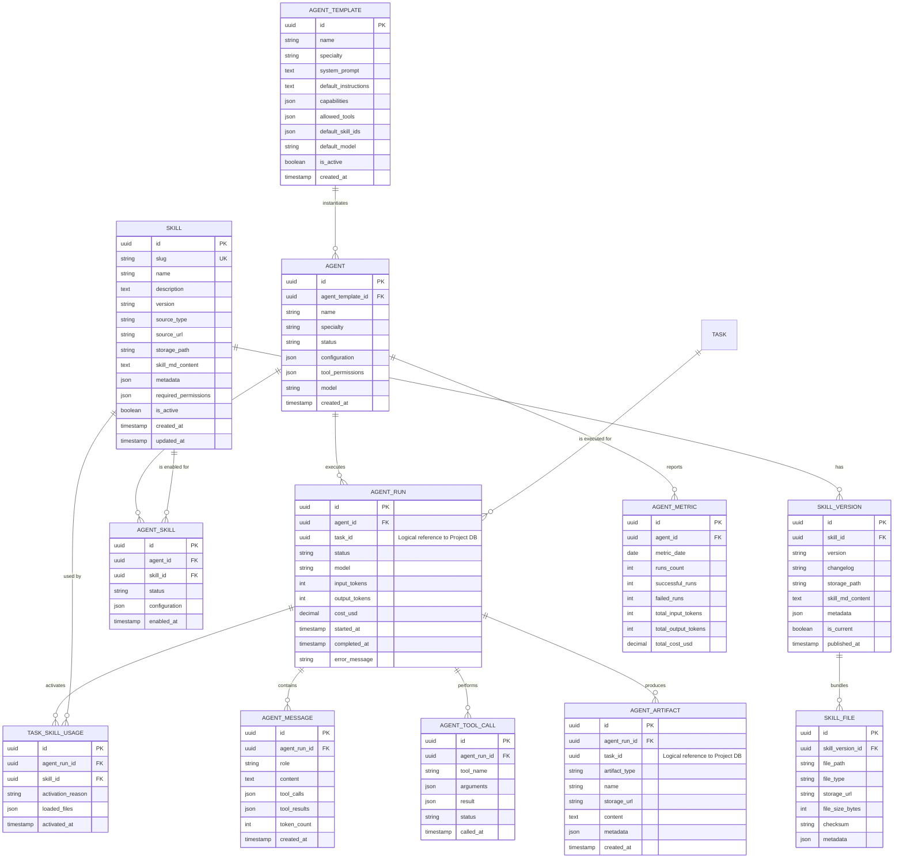

# Agents

```mermaid
erDiagram
    AGENT_TEMPLATE {
        uuid id PK
        string name
        string specialty
        text system_prompt
        text default_instructions
        json capabilities
        json allowed_tools
        json default_skill_ids
        string default_model
        boolean is_active
        timestamp created_at
    }

    AGENT {
        uuid id PK
        uuid agent_template_id FK
        string name
        string specialty
        string status
        json configuration
        json tool_permissions
        string model
        timestamp created_at
    }

    SKILL {
        uuid id PK
        string slug UK
        string name
        text description
        string version
        string source_type
        string source_url
        string storage_path
        text skill_md_content
        json metadata
        json required_permissions
        boolean is_active
        timestamp created_at
        timestamp updated_at
    }

    SKILL_VERSION {
        uuid id PK
        uuid skill_id FK
        string version
        string changelog
        string storage_path
        text skill_md_content
        json metadata
        boolean is_current
        timestamp published_at
    }

    SKILL_FILE {
        uuid id PK
        uuid skill_version_id FK
        string file_path
        string file_type
        string storage_url
        int file_size_bytes
        string checksum
        json metadata
    }

    AGENT_SKILL {
        uuid id PK
        uuid agent_id FK
        uuid skill_id FK
        string status
        json configuration
        timestamp enabled_at
    }

    TASK_SKILL_USAGE {
        uuid id PK
        uuid agent_run_id FK
        uuid skill_id FK
        string activation_reason
        json loaded_files
        timestamp activated_at
    }

    AGENT_RUN {
        uuid id PK
        uuid agent_id FK
        uuid task_id "Logical reference to Project DB"
        string status
        string model
        int input_tokens
        int output_tokens
        decimal cost_usd
        timestamp started_at
        timestamp completed_at
        string error_message
    }

    AGENT_MESSAGE {
        uuid id PK
        uuid agent_run_id FK
        string role
        text content
        json tool_calls
        json tool_results
        int token_count
        timestamp created_at
    }

    AGENT_TOOL_CALL {
        uuid id PK
        uuid agent_run_id FK
        string tool_name
        json arguments
        json result
        string status
        timestamp called_at
    }

    AGENT_ARTIFACT {
        uuid id PK
        uuid agent_run_id FK
        uuid task_id "Logical reference to Project DB"
        string artifact_type
        string name
        string storage_url
        text content
        json metadata
        timestamp created_at
    }

    AGENT_METRIC {
        uuid id PK
        uuid agent_id FK
        date metric_date
        int runs_count
        int successful_runs
        int failed_runs
        int total_input_tokens
        int total_output_tokens
        decimal total_cost_usd
    }

    AGENT_TEMPLATE ||--o{ AGENT : "instantiates"

    AGENT ||--o{ AGENT_SKILL : "has enabled"
    SKILL ||--o{ AGENT_SKILL : "is enabled for"

    SKILL ||--o{ SKILL_VERSION : "has"
    SKILL_VERSION ||--o{ SKILL_FILE : "bundles"

    AGENT_RUN ||--o{ TASK_SKILL_USAGE : "activates"
    SKILL ||--o{ TASK_SKILL_USAGE : "used by"

    AGENT ||--o{ AGENT_RUN : "executes"
    TASK ||--o{ AGENT_RUN : "is executed for"

    AGENT_RUN ||--o{ AGENT_MESSAGE : "contains"
    AGENT_RUN ||--o{ AGENT_TOOL_CALL : "performs"
    AGENT_RUN ||--o{ AGENT_ARTIFACT : "produces"
    AGENT ||--o{ AGENT_METRIC : "reports"
```
