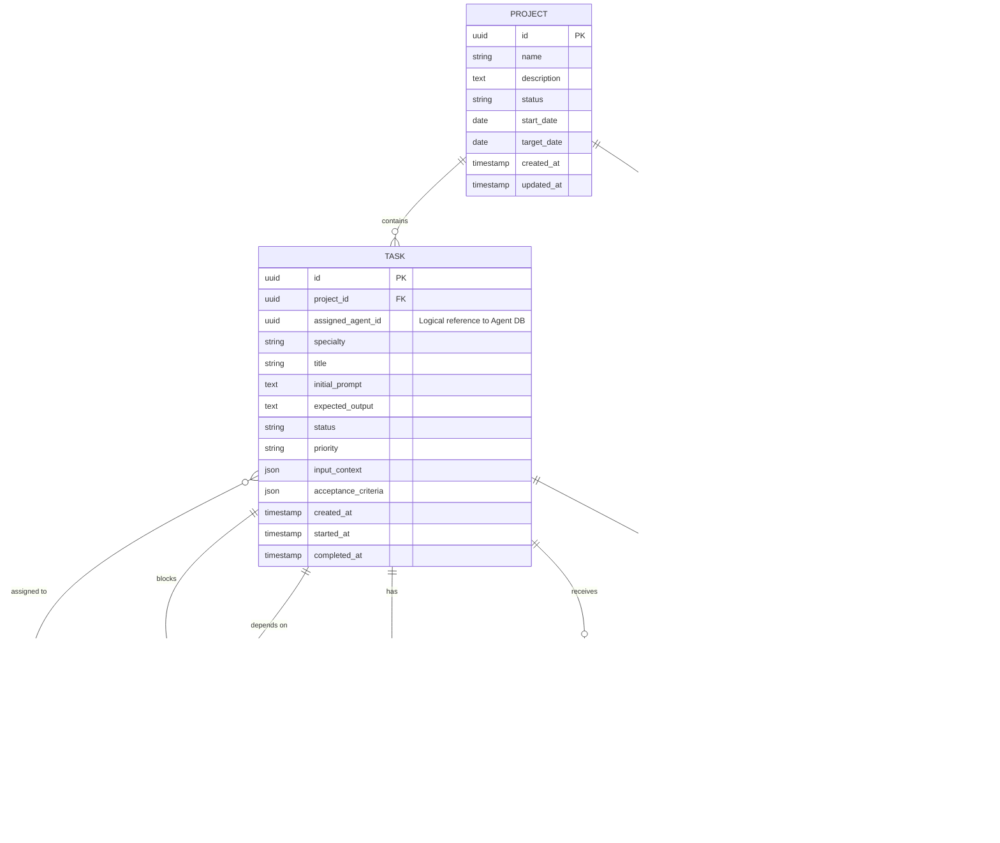

# Projects

```mermaid
erDiagram
    PROJECT {
        uuid id PK
        string name
        text description
        string status
        date start_date
        date target_date
        timestamp created_at
        timestamp updated_at
    }

    TASK {
        uuid id PK
        uuid project_id FK
        uuid assigned_agent_id "Logical reference to Agent DB"
        string specialty
        string title
        text initial_prompt
        text expected_output
        string status
        string priority
        json input_context
        json acceptance_criteria
        timestamp created_at
        timestamp started_at
        timestamp completed_at
    }

    TASK_DEPENDENCY {
        uuid id PK
        uuid task_id FK
        uuid depends_on_task_id FK
    }

    TASK_COMMENT {
        uuid id PK
        uuid task_id FK
        text content
        timestamp created_at
    }

    TASK_REVIEW {
        uuid id PK
        uuid task_id FK
        string decision
        text feedback
        string status
        timestamp created_at
    }

    ARTIFACT {
        uuid id PK
        uuid task_id FK
        uuid agent_run_id "Logical reference to Agent DB"
        string artifact_type
        string name
        string storage_url
        text content
        json metadata
        timestamp created_at
    }

    ACTIVITY_LOG {
        uuid id PK
        uuid project_id FK
        string action
        string entity_type
        uuid entity_id
        json metadata
        timestamp created_at
    }

    PROJECT ||--o{ TASK : "contains"
    TASK }o--|| AGENT : "assigned to"

    TASK ||--o{ TASK_DEPENDENCY : "blocks"
    TASK ||--o{ TASK_DEPENDENCY : "depends on"

    TASK ||--o{ TASK_COMMENT : "has"
    TASK ||--o{ TASK_REVIEW : "receives"
    TASK ||--o{ ARTIFACT : "produces"
    AGENT_RUN ||--o{ ARTIFACT : "generates"

    PROJECT ||--o{ ACTIVITY_LOG : "records"
```
